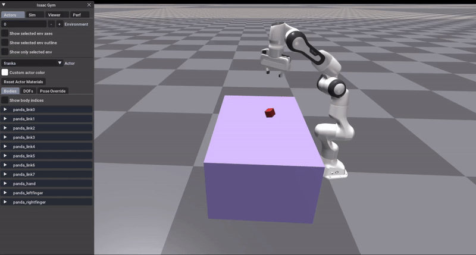
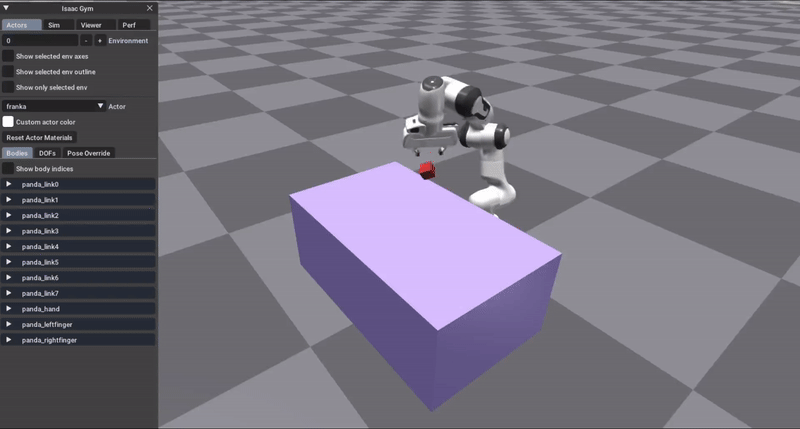
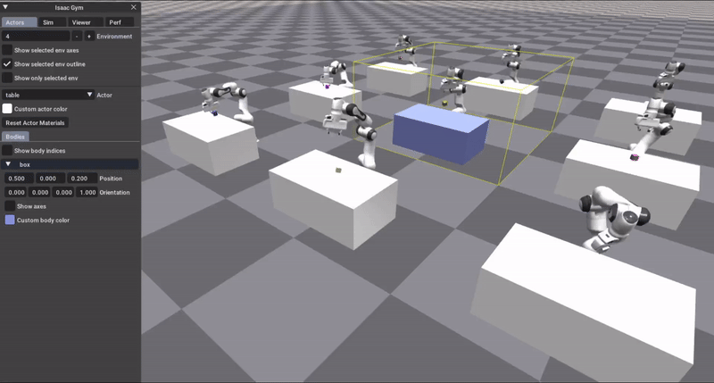

# Franka Arm manipulate the Cube

<div align="center">

[](https://github.com/eureka-research/Eureka)
[](https://pytorch.org/)
[](/home/boubacar-diallo/Documents/Franka_arm_Cube/LICENSE)

This example demonstrates interaction between Franka arm and Cube. 
We use Jacobian matrix and inverse kinematics control of Franka robot to pick up a box ([Damped Least Squares method](https://www.math.ucsd.edu/~sbuss/ResearchWeb/ikmethods/iksurvey.pdf))

The "Franka Arm" refers to a robotic arm developed by [Franka Emika GmbH](https://franka.de/), a German robotics company. The Franka Arm is known for its versatility, precision, and ease of use. It is often used in various industrial applications, research laboratories, and educational settings for tasks such as assembly, manipulation, and human-robot interaction. With its seven degrees of freedom and advanced control capabilities, the Franka Arm is suitable for a wide range of tasks in robotics and automation.


</div>

# Installation
Franka requires Python ≥ 3.8. We have tested on Ubuntu 22.04.

Follow the instruction :

1. Create a new conda environment with:
    ```
    conda create -n franka python=3.8
    conda activate franka
    pip install numpy==1.20.0
    ```

2. Clone the repository
    ```
    git clone https://github.com/boubacardiallo20/Franka_arm_Cube.git
    cd Franka_arm_Cube
    ```

3. Install IsaacGym (tested with `Preview Release 4/4`). IsaacGymEnvs contains example RL environments for the NVIDIA Isaac Gym high performance environments described [in NeurIPS 2021 Datasets and Benchmarks paper](https://openreview.net/forum?id=fgFBtYgJQX_)
    ```	
    cd isaacgym/python
    pip install -e .
    (test installation) python examples/joint_monkey.py
    ```
    

# Getting Started
Go to franka folder
```
cd ../../franka
```
Helper from the function franka_cube_ik.py
```
usage: franka_cube_ik.py [-h] [--sim_device SIM_DEVICE] [--pipeline PIPELINE] [--graphics_device_id GRAPHICS_DEVICE_ID] [--flex | --physx] [--num_threads NUM_THREADS] [--subscenes SUBSCENES] [--slices SLICES] [--controller CONTROLLER]
                         [--num_envs NUM_ENVS]

Franka Jacobian Inverse Kinematics (IK) + Operational Space Control (OSC) Example

optional arguments:
  -h, --help            show this help message and exit
  --sim_device SIM_DEVICE
                        Physics Device in PyTorch-like syntax
  --pipeline PIPELINE   Tensor API pipeline (cpu/gpu)
  --graphics_device_id GRAPHICS_DEVICE_ID
                        Graphics Device ID
  --flex                Use FleX for physics
  --physx               Use PhysX for physics
  --num_threads NUM_THREADS
                        Number of cores used by PhysX
  --subscenes SUBSCENES
                        Number of PhysX subscenes to simulate in parallel
  --slices SLICES       Number of client threads that process env slices
  --controller CONTROLLER
                        Controller to use for Franka. Options are {ik, osc} - default: "ik"
  --num_envs NUM_ENVS   Number of environments to create - default: 256
```
#### Launch Franka Arm with Cube
```
python3 franka_cube_ik.py --pipeline=gpu --graphics_device_id=0 --num_envs=1 --sim_device="cuda:0"
```


#### Launch the Franka Arm with 9 diverse operational environments.
```
python3 franka_cube_ik.py --pipeline=gpu --graphics_device_id=0 --num_envs=9 --sim_device="cuda:0"
```


##
<p align="center"><sup>© 2024/04 Boubacar DIALLO | </sup><a href="#franka-arm-manipulate-the-cube"><sup>Top of the page</sup></a></p>